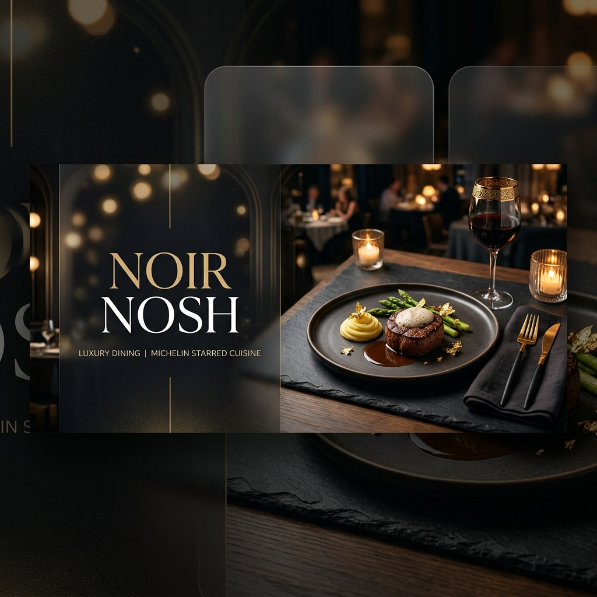
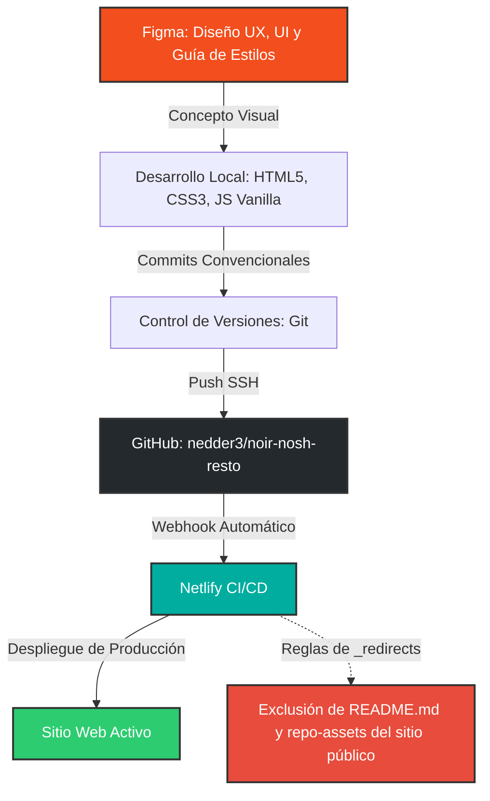

# Noir Nosh - Restaurante Exclusivo



**Noir Nosh** es un sitio web de alta cocina y restaurante exclusivo, diseñado y programado bajo los más altos estándares visuales y de desarrollo de software. El proyecto presenta una experiencia inmersiva que combina sofisticación, minimalismo oscuro, detalles dorados, tipografías elegantes (Playfair Display e Inter), y efectos modernos como glassmorphism y micro-animaciones fluidas.

Este repositorio documenta no solo el código del sitio, sino también el flujo completo de trabajo, metodologías y tecnologías utilizadas en su creación.

---

## 📐 Proceso de Diseño y Desarrollo

El ciclo de vida del proyecto siguió un flujo moderno de integración continua y desarrollo guiado por diseño, ilustrado a continuación:



---

## 🎨 1. Diseño UX/UI en Figma y Sistema de Diseño

El diseño de **Noir Nosh** nació en **Figma**, donde se estructuraron las páginas clave:
*   **Inicio (Home):** Un diseño de gran impacto visual con imágenes a pantalla completa y tipografías contrastadas.
*   **Menú:** Una estructura clara y premium que muestra los platos exclusivos con sus precios.
*   **Reservas:** Un formulario intuitivo y elegante enfocado en la conversión y la experiencia de usuario.

### Documentación del Sistema de Diseño
Toda la investigación conceptual y el sistema de diseño se integran en el repositorio mediante dos páginas de documentación dedicadas (no indexadas para motores de búsqueda, con etiqueta `noindex` para mantener la exclusividad del sitio principal):
*   [Investigación y Concepto UX (investigacion.html)](file:///Users/ajaime/Desktop/noir%20nosh/investigacion.html): Recopila las decisiones de UX, el público objetivo y la identidad de marca de Noir Nosh.
*   [Sistema de Diseño (sistemadiseno.html)](file:///Users/ajaime/Desktop/noir%20nosh/sistemadiseno.html): Define los tokens de diseño (colores, espaciados, tipografía, botones, inputs y componentes interactivos).

---

## 💻 2. Programación y Arquitectura de Software

El sitio fue construido utilizando tecnologías nativas de la web (Vanilla stack) para asegurar un rendimiento excepcional y máxima velocidad de carga:
*   **HTML5 Semántico:** Para una estructura limpia y accesible.
*   **CSS3 Personalizado (Vanilla CSS):** Implementación de una arquitectura basada en variables de CSS (Tokens de diseño) para facilitar la consistencia en el espaciado, colores y fuentes, junto con animaciones clave como `reveal` al hacer scroll.
*   **JS Vanilla & Framework de Traducción (i18n):** Un motor de internacionalización ligero desarrollado a medida en JavaScript, que permite cambiar dinámicamente entre Español (ES), Inglés (EN) y Francés (FR) de forma instantánea y persistiendo la selección del usuario en `localStorage`.

---

## 🔄 3. Control de Versiones con Commits Convencionales

El desarrollo se organizó minuciosamente utilizando **Conventional Commits** (Commits Convencionales). Esta práctica permite mantener un historial de Git ordenado, autodescriptivo y fácil de auditar.

El formato utilizado sigue el estándar:
`tipo(ámbito): descripción corta en imperativo`

### Historial de Commits del Proyecto
Los cambios estructurales y funcionales se segmentaron de la siguiente manera:

*   `chore(repo):`: Tareas de configuración inicial y mantenimiento.
    *   *Ejemplo:* Inicialización del repositorio Git y configuración de `.gitignore`.
*   `feat(assets):`: Importación y organización de archivos multimedia.
    *   *Ejemplo:* Incorporación de imágenes del restaurante en alta resolución.
*   `feat(styles):`: Estructuración de las reglas de estilo globales y tokens de diseño en CSS.
*   `feat(js):`: Implementación del núcleo lógico en JavaScript para navegación e interactividad.
*   `feat(home | menu | reservation | error):`: Desarrollo incremental de cada página del sitio.
    *   *Ejemplos:* `feat(home): add home index page`, `feat(menu): add menu page`.
*   `feat(i18n):`: Integración de traducción multilingüe.
    *   *Ejemplos:* `feat(i18n): add multi-language dictionary`, `feat(menu): integrate translation tags`.
*   `feat(docs):`: Creación de páginas de documentación técnica y conceptual.

---

## 🚀 4. Integración y Despliegue Continuo (CI/CD)

El código fuente está alojado en **GitHub** en el repositorio `git@github.com:nedder3/noir-nosh-resto.git`. El pipeline de entrega continua está configurado mediante **Netlify**:

1.  **Conexión Git-Netlify:** Netlify está vinculado directamente a la rama principal (`main`) del repositorio en GitHub.
2.  **Despliegue Automático (Continuous Deployment):** Cada vez que se hace un `git push` a la rama `main`, Netlify detecta los commits de manera instantánea y realiza un despliegue automático del sitio web.
3.  **Seguridad y Exclusión del Sitio Público:**
    Para cumplir con el requerimiento de que el archivo `README.md` y los recursos de presentación (como el banner del repositorio) no estén expuestos ni sean accesibles de forma pública a través de la URL de producción, se implementó un archivo de configuración de redirecciones en la raíz del proyecto ([_redirects](file:///Users/ajaime/Desktop/noir%20nosh/_redirects)).

    El archivo contiene las siguientes reglas:
    ```text
    /README.md       /404.html  404
    /readme.md       /404.html  404
    /repo-assets/*   /404.html  404
    ```
    Esto garantiza que si un usuario intenta navegar directamente a `midominio.netlify.app/README.md` o a la carpeta de recursos de presentación, Netlify retornará un código de estado HTTP `404 Not Found` renderizando la página personalizada de error 404 del restaurante, protegiendo así los archivos de administración y diseño interno.

---

## 🌟 Características Destacadas de la Entrega

*   **Premium & Responsive:** Adaptable a todo tipo de dispositivos móviles, tablets y ordenadores con un diseño responsivo fluido.
*   **Velocidad de Carga:** Al no depender de librerías o frameworks pesados, la velocidad de carga de la web es casi instantánea.
*   **Internacionalización Completa:** Traducción instantánea de toda la información de contacto, precios del menú, títulos y formularios de reservación.
*   **Fácil Mantenimiento:** Estructura modular donde añadir un nuevo idioma o plato al menú toma escasos minutos debido al diccionario estructurado en JS.
